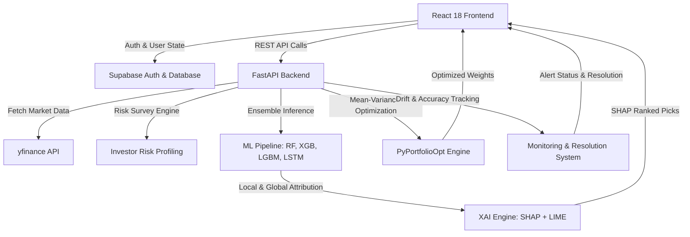

# 📈 AI-Powered Investment Recommendation & Portfolio Optimization System

An enterprise-grade, full-stack AI-driven financial platform for **NIFTY 50 equities** and **Mutual Funds**. Built with **React 18**, **FastAPI**, **Supabase (PostgreSQL + RLS)**, **Scikit-learn**, **XGBoost**, **LightGBM**, **TensorFlow (LSTM)**, **SHAP**, **LIME**, and **PyPortfolioOpt**.

The platform combines multi-model machine learning predictions with dual explainability frameworks (SHAP & LIME), Modern Portfolio Theory (MPT) optimization, personalized risk profiling, live ML model monitoring/drift resolution, and an enterprise Navy & Gold UI design.

---

## 🌟 Key Features & Implementation Status

| # | Feature Area | Primary Endpoints / Modules | Key Technology / Skill | Status |
|:--|:-------------|:----------------------------|:-----------------------|:-------|
| 1 | **Investor Risk Profiling & Onboarding** | `GET/POST /profile/` | Weighted scoring algorithm, risk tolerance categorization (Low/Medium/High) | ✅ Complete |
| 2 | **NIFTY 50 Equity Screener** | `GET /screener/` | Multi-ticker pooled ML models, directional signal scoring (Buy/Hold/Sell) | ✅ Complete |
| 3 | **Multi-Model Price Prediction** | `GET /prediction/{ticker}` | Ensemble of Random Forest, XGBoost, LightGBM, and LSTM neural network | ✅ Complete |
| 4 | **Dual Explainable AI (SHAP + LIME)** | `GET /prediction/{ticker}` | SHAP TreeExplainer (global/local attribution) + LIME local linear surrogate | ✅ Complete |
| 5 | **Top Picks Engine** | `GET /screener/` (filtered) | SHAP-ranked equity recommendations tailored to investor risk profile | ✅ Complete |
| 6 | **Personalized Mutual Fund Ranking** | `GET /mutual-funds/` | Multi-factor risk-return scoring (Alpha, Sharpe, Expense Ratio) | ✅ Complete |
| 7 | **MPT Portfolio Optimization** | `POST /portfolio/optimize` | PyPortfolioOpt (Mean-Variance optimization, Efficient Frontier, Sharpe maximization) | ✅ Complete |
| 8 | **System Monitoring & Drift Resolution** | `GET /monitoring/metrics`, `POST /monitoring/resolve/{id}` | Real-time accuracy metrics, RMSE/MAE drift tracking, anomaly resolution workflow | ✅ Complete |

---

## 🏗️ Architecture & Technology Stack

### Tech Stack Table

| Layer | Technology & Libraries |
|:------|:-----------------------|
| **Frontend** | React 18, Vite, React Router v6, Recharts, Lucide Icons, Vanilla CSS (Enterprise Navy/Gold Design System) |
| **Backend** | Python 3.10+, FastAPI, Uvicorn, Pydantic, yfinance, Pandas, NumPy |
| **Machine Learning & XAI** | Scikit-learn, XGBoost, LightGBM, TensorFlow / Keras (LSTM), SHAP, LIME |
| **Portfolio Optimization** | PyPortfolioOpt, SciPy optimization routines |
| **Database & Auth** | Supabase PostgreSQL, Row Level Security (RLS), Supabase JS Client |

### System Data Flow



---

## 📁 Project Directory Structure

```
investment-recommendation-system/
├── backend/
│   ├── app/
│   │   ├── config.py                 # Central configuration & path bindings
│   │   ├── feature_engineering.py    # Technical indicator generation (RSI, MACD, SMA, Volatility)
│   │   ├── pooled_feature_engineering.py # Multi-ticker pooled dataset transformer
│   │   ├── main.py                   # FastAPI application initialization & CORS config
│   │   ├── models/                   # Pre-trained ML model binaries & scalers (.pkl, .h5, .json)
│   │   ├── routers/
│   │   │   ├── profile.py            # Risk profiling & survey endpoints
│   │   │   ├── prediction.py         # Multi-model inference + SHAP & LIME XAI
│   │   │   ├── screener.py           # NIFTY 50 equity screener & signals
│   │   │   ├── mutual_funds.py       # Risk-aligned mutual fund recommendations
│   │   │   ├── portfolio.py          # MPT portfolio optimization & user holdings
│   │   │   └── monitoring.py         # System health, model performance & drift resolution
│   │   └── services/
│   │       ├── lime_explainer.py     # LIME surrogate model explainer service
│   │       ├── risk_scoring.py       # Investor questionnaire risk categorization logic
│   │       └── supabase_client.py   # Database client initialization
│   ├── requirements.txt              # Backend Python dependencies
│   └── .env                          # Environment secrets (Supabase credentials)
├── frontend/
│   ├── src/
│   │   ├── api/
│   │   │   └── client.js             # Axios API client wrapper with auth interceptors
│   │   ├── components/
│   │   │   ├── DashboardLayout.jsx   # Shell layout with enterprise sidebar nav & topbar
│   │   │   ├── ExplainabilityGuide.jsx # Plain-language guide for SHAP & LIME explanations
│   │   │   ├── PageGuide.jsx         # Contextual interactive modal guide for pages
│   │   │   ├── ProtectedRoute.jsx    # Route protection guard based on auth session
│   │   │   └── ui.jsx                # Core UI primitives (Buttons, Cards, Badges, Modals)
│   │   ├── context/
│   │   │   └── AuthContext.jsx       # Global Supabase Auth state provider
│   │   ├── pages/
│   │   │   ├── OverviewPage.jsx      # Summary dashboard with portfolio overview & quick stats
│   │   │   ├── TopPicksPage.jsx      # SHAP-ranked equity recommendations for risk profile
│   │   │   ├── PredictionPage.jsx    # Single-stock deep dive with multi-model XAI charts
│   │   │   ├── ScreenerPage.jsx      # Interactive NIFTY 50 equity screener table
│   │   │   ├── MutualFundsPage.jsx   # Personalized mutual fund discovery & filtering
│   │   │   ├── PortfolioPage.jsx     # MPT optimization calculator & holdings manager
│   │   │   ├── PerformancePage.jsx   # Model monitoring, drift metrics & alert resolution
│   │   │   ├── OnboardingPage.jsx    # Step-by-step investor risk questionnaire
│   │   │   ├── SettingsPage.jsx      # User profile, risk preference & system settings
│   │   │   ├── LoginPage.jsx         # User login authentication
│   │   │   └── SignupPage.jsx        # User registration authentication
│   │   ├── App.jsx                   # React Router routing setup
│   │   ├── index.css                 # Navy & Gold enterprise design tokens & utilities
│   │   └── main.jsx                  # React entrypoint
│   ├── package.json                  # Frontend dependencies
│   └── vite.config.js                # Vite build configuration
├── supabase_migration_phase2.sql     # Database schema migrations, RLS & tables
└── README.md                         # Project documentation
```

---

## 🚀 Key Modules Deep-Dive

### 1. Investor Risk Profiling
- **Questionnaire**: 5-question financial profile covering age horizon, investment experience, loss tolerance, time frame, and primary objective.
- **Scoring Logic**: Weighted algorithmic score (0–100 scale):
  - `0 – 35`: Conservative (Low Risk Tolerance) — favors debt funds & low-beta blue-chip equities.
  - `36 – 70`: Moderate (Medium Risk Tolerance) — balanced equity/debt allocation.
  - `71 – 100`: Aggressive (High Risk Tolerance) — growth equities, momentum stocks, and high-beta assets.

### 2. Multi-Model ML Ensemble & SHAP/LIME Explainability
- **Engineered Features**: Relative Strength Index (RSI), Moving Average Convergence Divergence (MACD), Simple Moving Averages (SMA 20/50/200), Historical Volatility, Bollinger Band width, and Volume trends.
- **Models**:
  - **Random Forest**: Ensemble decision trees for baseline directional classification.
  - **XGBoost & LightGBM**: Gradient-boosted decision trees for precision momentum detection.
  - **LSTM Neural Network**: Deep learning sequential pattern model trained on time-series windows.
- **Explainability Framework**:
  - **SHAP (SHapley Additive exPlanations)**: Calculates game-theoretic feature attributions for model outputs.
  - **LIME (Local Interpretable Model-agnostic Explanations)**: Fits local surrogate linear models to explain specific single-stock predictions.
  - **Explainability Guide**: Integrated modal in the UI translating mathematical feature weights into actionable investor takeaways.

### 3. Modern Portfolio Theory (MPT) Optimization
- **Mean-Variance Engine**: Utilizes historical stock returns to construct covariance matrices and optimize asset weights.
- **Risk Personalization**: Adjusts target volatility and Sharpe ratio optimization based on user risk score.
- **Efficient Frontier**: Generates optimal portfolio weights, expected annual return, annual volatility, and Sharpe ratio.

### 4. Real-Time System Monitoring & Alert Resolution
- **Performance Metrics**: Tracks directional accuracy, Root Mean Square Error (RMSE), Mean Absolute Error (MAE), and R² score across all active ticker models.
- **Drift Alerts**: Detects model performance degradation and market anomalies.
- **Resolution Workflow**: Allows system administrators/analysts to trigger model retrains or resolve alerts directly from the **Performance & Monitoring** dashboard.

---

## 🔌 API Reference Summary

### Risk Profile Endpoints (`/profile`)
- `GET /profile/` — Fetch current user's risk profile & score.
- `POST /profile/` — Submit risk questionnaire and compute profile score.

### Prediction & XAI Endpoints (`/prediction`)
- `GET /prediction/{ticker}` — Fetch multi-model price predictions, confidence levels, SHAP feature attributions, and LIME surrogate explanations for a ticker (e.g., `RELIANCE.NS`, `TCS.NS`).

### Stock Screener & Top Picks Endpoints (`/screener`)
- `GET /screener/` — Fetch screener table for NIFTY 50 equities with model signals, confidence scores, and technical indicators.

### Mutual Funds Endpoints (`/mutual-funds`)
- `GET /mutual-funds/` — Fetch risk-aligned mutual fund recommendations filtered by category (Equity, Debt, Hybrid) and rating.

### Portfolio Optimization Endpoints (`/portfolio`)
- `POST /portfolio/optimize` — Calculate MPT optimal portfolio weights for selected tickers given investor risk tolerance.
- `GET /portfolio/` — Fetch user's stored portfolio holdings.
- `POST /portfolio/` — Save or update user portfolio holdings.

### System Monitoring Endpoints (`/monitoring`)
- `GET /monitoring/metrics` — Retrieve global ML model performance metrics, accuracy breakdown, and active alerts.
- `POST /monitoring/resolve/{alert_id}` — Resolve or acknowledge an active monitoring alert.

---

## 🛠️ Local Installation & Setup

### Prerequisites
- **Node.js**: v18+ and `npm`
- **Python**: v3.10+
- **Supabase Account**: Free tier project at [supabase.com](https://supabase.com)

---

### Step 1: Database Setup (Supabase)
1. Log in to your Supabase project dashboard.
2. Navigate to **SQL Editor → New Query**.
3. Copy and execute the contents of `supabase_migration_phase2.sql`.
4. Verify that tables (`investor_profiles`, `user_portfolios`, `monitoring_alerts`, etc.) are created with Row Level Security (RLS) policies enabled.

---

### Step 2: Backend Setup
1. Navigate to the backend directory:
   ```bash
   cd backend
   ```
2. Create and activate a Python virtual environment:
   ```bash
   python -m venv venv
   # Windows:
   venv\Scripts\activate
   # macOS/Linux:
   source venv/bin/activate
   ```
3. Install Python dependencies:
   ```bash
   pip install -r requirements.txt
   ```
4. Create a `.env` file in the `backend/` directory:
   ```env
   SUPABASE_URL=https://your-supabase-project.supabase.co
   SUPABASE_KEY=your-supabase-anon-key
   ```
5. Run the FastAPI dev server:
   ```bash
   uvicorn app.main:app --reload --port 8000
   ```
   *The API documentation will be available at `http://localhost:8000/docs`.*

---

### Step 3: Frontend Setup
1. Navigate to the frontend directory:
   ```bash
   cd frontend
   ```
2. Install dependencies:
   ```bash
   npm install
   ```
3. Create a `.env` file in the `frontend/` directory:
   ```env
   VITE_SUPABASE_URL=https://your-supabase-project.supabase.co
   VITE_SUPABASE_ANON_KEY=your-supabase-anon-key
   VITE_API_URL=http://localhost:8000
   ```
4. Start the Vite local development server:
   ```bash
   npm run dev
   ```
   *Access the web app in your browser at `http://localhost:5173`.*

---

## 🎨 Enterprise Navy & Gold Design System

The application features a tailored design system built with custom CSS variables:

- **Primary Colors**: Deep Enterprise Navy (`#0A192F`, `#112240`), Muted Slate Blue (`#233554`)
- **Accent Colors**: Warm Metallic Gold (`#D4AF37`), Soft Amber (`#F59E0B`)
- **Backgrounds**: Clean Pearl Gray (`#F8FAFC`), Ice White (`#FFFFFF`)
- **Typography**: Inter (Body font) & Lora (Editorial headers)
- **Interactive Elements**: Glassmorphic cards, responsive sidebar, status badges, contextual page guide modals, and Recharts financial charts.

---

## 🧪 Verification & Build

To test and build the application:

```bash
# Frontend build verification
cd frontend
npm run build

# Python backend syntax & module check
cd backend
python -m py_compile app/main.py
```

---

## 📜 License

Distributed under the **MIT License**. See `LICENSE` for details.
